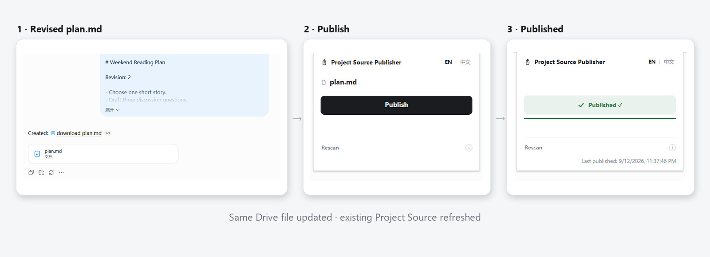
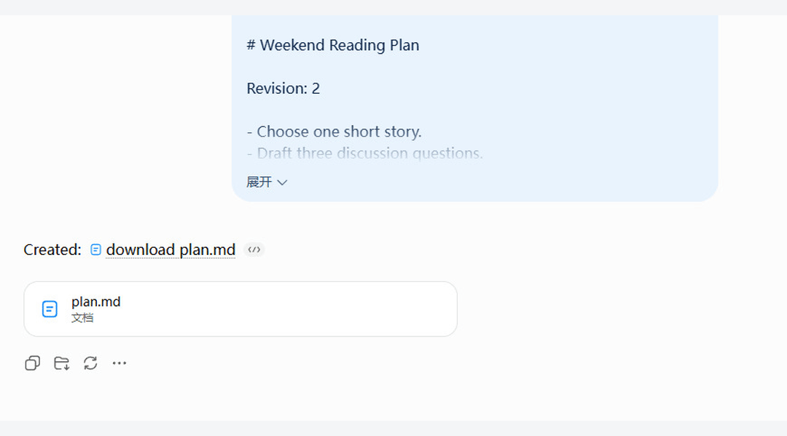

# Project Source Publisher

**English** | [简体中文](README.zh-CN.md)

**Keep your ChatGPT Project Sources up to date as your Markdown evolves.**

A browser extension that takes Markdown files generated in your Project conversation, saves them to Google Drive, and refreshes the Sources you've connected. Spend less time moving revised files between ChatGPT and Drive.

**First time:** connect each Source → **After that:** generate a revision with the same filename → **Publish**

## Availability

**v0.3.3 · GitHub public beta · Edge Add-ons update pending submission/review**

The source code is public. The Edge package has passed package verification and has been submitted for review; this is not store approval. The listing is not live, so there is **no supported public install link yet**. Testing of the store-installed extension is still pending.

Loading an arbitrary Git clone unpacked is not a supported Google OAuth installation path. Chrome Web Store distribution is deferred and has not been published.

Interested in trying it? Check this section for the supported Edge install link when available. In the meantime, [ask a question or share your use case](https://github.com/bevis7781/project-source-publisher/issues).

## Where it saves work

If you regularly revise plans, specifications, or reference notes in a ChatGPT Project, the repetitive part is getting each new Markdown version back into its Source.

Once a Source is established with PSP, you don't need to manually download the revision, replace the Drive content, and trigger the Source refresh yourself. **Publish** updates the existing Drive file and runs the refresh. The filename must match exactly; the underlying Drive file ID stays the same.

For example: connect `plan.md` once, then generate a revised `plan.md` in the same Project and publish it to update that Source.

## The workflow

### First time: connect your Sources

1. Open your ChatGPT Project conversation with the generated Markdown files loaded and visible.
2. Open PSP and choose **Publish**. Follow the Google Drive authorization prompt.
3. For each Source, follow **Copy Drive link → Add** on the Project Sources page. This connection step requires your action for each file.

### Everyday updates: publish the revision

1. Generate revised Markdown files using the established filenames in the Project conversation.
2. Open PSP and choose **Publish**. It checks the bound file identities, writes the updates, and reads the contents back to verify them before refreshing the Sources.
3. Follow the progress for each file. PSP shows **Published** for the whole operation only when every target has sufficient completion confirmation.

*Real PSP v0.3.1 pre-store runtime using a non-sensitive test Project.*

PSP follows the current ChatGPT Project automatically, offers English and Chinese interfaces, and checks Source identity before restoring connections after a reinstall.

## Scope and known limitations

- **1–10 Markdown files from one response.** PSP uses the latest loaded, visible assistant response containing file attachments. It does not combine responses or search the full conversation history. A newer response with only non-Markdown attachments does not make it fall back to older Markdown files.
- **Updates stay with established Sources.** A new or changed filename is not automatically added during refresh, and similar names are not treated as replacements. PSP is not a general Source manager: no rename, delete, merge, split, or arbitrary upload.
- **A Drive save and a confirmed Source update are different.** First-time Add can show **Saved to Drive · confirmation unavailable**. The file was saved, but PSP cannot confirm final completion from the ChatGPT state it can observe. This is not proof that the save failed; it is also not a confirmed publication.
- **Platform compatibility can change.** The workflow needs Google Drive and an authenticated ChatGPT Project session with access to Drive-backed Sources. It depends on ChatGPT's interface and session behavior, not an official OpenAI API integration; changes to the interface or platform policies may affect or prevent operation.

## Privacy and trust

PSP runs in your browser, with **no developer backend, telemetry, or advertising**. Selected Markdown is sent to your Google Drive; operational metadata is stored locally in the extension.

Google Drive access uses only the `drive.file` scope, not full-Drive access. Browser permissions are `activeTab`, `scripting`, `downloads`, `identity`, and `storage`, with host access to ChatGPT and Google APIs. The [Privacy Policy](PRIVACY.md) explains data handling, authentication, and retention.

This is an independent, unofficial project, not affiliated with, endorsed by, or sponsored by OpenAI or Google.

[Security Policy](SECURITY.md) · [Changelog](CHANGELOG.md) · [MIT License](LICENSE)
